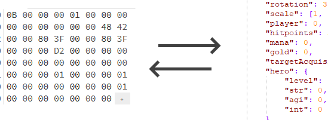

## Overview
War3map is a module to convert between a JSON representation of WarCraft III (.w3x) data and `war3map` format files.



War3map is written in `TypeScript`, offering type safety and improved development experience.

## Install
```js
npm install war3map
```

**Requires Node >= 8**  
**Tested with tsc >= 3.7.2**

## Usage

Not finished yet, until version >= 1.0.0


## Contributing
We encourage contributions! Generally, the process of making a change is:
1. Fork this repo
2. Develop your changes on a new branch
3. Submit a pull request to `master`

**Your code should**:
 * **run** (your code needs to work, of course)
 * **include tests** (write unit tests to demonstrate your code works under different conditions)
 * **be linted** (run `npm run lint` and follow the project's coding standards)
 * **pass CI** (we enforce: ESLint, unit tests pass, code coverage)

A code review is required on your PR to be accepted into `master`. A project member will get back to you within one week.

## Reference
This project refers a lot from [WC3MapTranslator](https://github.com/ChiefOfGxBxL/WC3MapTranslator) written by *ChiefOfGxBxL* etc. Our goal is same but offers different API.

## Special Thanks
We owe a lot of thanks to *Chocobo* on [TheHelper](http://www.thehelper.net/) for the detailed documentation of the files found in a .w3x archive. And another two tutorials are [here (1)](http://www.thehelper.net/threads/guide-explanation-of-w3m-and-w3x-files.35292/) and [here (2)](http://world-editor-tutorials.thehelper.net/cat_usersubmit.php?view=42787) and [here (3)](https://867380699.github.io/blog/2019/05/09/W3X_Files_Format).