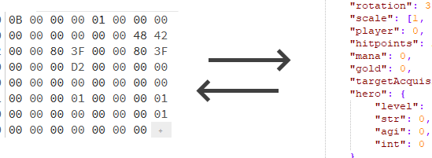

**Not finished yet, please wait until version >= 1.0.0.**

[![Contributors][contributors-shield]][contributors-url]
[![Forks][forks-shield]][forks-url]
[![Stargazers][stars-shield]][stars-url]
[![Issues][issues-shield]][issues-url]
[![MIT License][license-shield]][license-url]
[![Language][language-shield]][language-url]
[![Build Status][build-status-shield]][build-status-url]
[![Coverage Status][coverage-status-shield]][coverage-status-url]
<br />
<p align="center">
  <a alt="WAR" href="https://github.com/invoker-bot/war3map">
    
  </a>
  <h3 align="center">WAR3MAP</h3>
  <p align="center">
    An awesome war3 map translator library for your project!
    <br />
    <a href="https://invoker-bot.github.io/war3map"><strong>Explore the docs »</strong></a>
    <br />
    <br />
    <a href="https://github.com/invoker-bot/war3map">View Repository</a>
    ·
    <a href="https://github.com/invoker-bot/war3map/issues">Report Bug</a>
    ·
    <a href="https://github.com/invoker-bot/war3map/issues">Request Feature</a>
  </p>
</p>

## Table of Contents

* [Overview](#Overview)
* [Support](#Support)
    * [Support Files](#support-files)
    * [Object data files](#object-data-files)
    * [Trigger files](#trigger-files)
    * [Map files](#map-files)
    * [Raw and binary pass-through files](#raw-and-binary-pass-through-files)
* [Getting Started](#getting-started)
    * [Prerequisites](#Prerequisites)
    * [Import](#Import)
    * [Development](#Development)
* [Roadmap](#Roadmap)
* [Contributing](#Contributing)
* [License](#License)
* [Contact](#Contact)
* [Acknowledgements](#Acknowledgements)

## Overview
War3map is a module to convert between a Object representation of WarCraft III (.w3x) data and `war3map` format files.



War3map is written in `TypeScript`, offering type safety and improved development experience.

Here's some places where you can use this library:
* You need to decompile a map of Warcraft 3. 
* You want to write a map editor for Warcraft 3.
* You want to optimize or encrypt your Warcraft 3 map.

## Support

### Support Files

| Type | Object → War | War → Object | File |
| --- | :-: | :-: | --- |
| Environment | ![check][ok] | ![check][ok] | war3map.w3e |
| Units  | ![check][ok] | ![check][ok] | war3mapUnits.doo |
| Doodads | ![check][ok] | ![check][ok] | war3map.doo |
| Regions | ![check][ok] | ![check][ok] | war3map.w3r |
| Cameras | ![check][ok]  | ![check][ok]  | war3map.w3c |
| Sounds(definitions)| ![check][ok] | ![check][ok] | war3map.w3s|

`UnitsObject` supports both RoC `war3mapUnits.doo` v7/subversion 9 and TFT
v8/subversion 11 layouts, including byte-preserving duplicate item drops.
`EnvironmentObject` supports terrain `war3map.w3e` v11 and Reforged v12
texture flag layouts.

### Object data files

| Type  | Object → War | War → Object  | File |
| ---   |   :-----------:  |  :-:   |  ----  |
| Units - Objects | ![check][ok] | ![check][ok] | war3map.w3u     |
| Items - Objects | ![check][ok] | ![check][ok] | war3map.w3t     |
| Abilities - Objects | ![check][ok] | ![check][ok] | war3map.w3a     |
| Destructables - Objects | ![check][ok] |![check][ok] | war3map.w3b     |
| Doodads - Objects   | ![check][ok] | ![check][ok] | war3map.w3d     |
| Upgrades - Objects  | ![check][ok] | ![check][ok] | war3map.w3q     |
| Buffs - Objects   | ![check][ok] | ![check][ok] | war3map.w3h     |

### Trigger files

|   Type | Object → War  | War → Object  | File |
|   ---  |   :-:   |   :-:   |   ---    |
| LUA    | ![check][ok] | ![check][ok] | war3map.lua  |
| JASS   | ![check][ok] | ![check][ok] | war3map.j    |
| Strings  | ![check][ok] | ![check][ok] | war3map.wts  |
| Custom Text Triggers | ![check][ok] | ![check][ok] | war3map.wct |
| Trigger Definitions | ![check][ok] | ![check][ok] | war3map.wtg |

`TriggerNamesObject` preserves full `war3map.wtg` bytes and exposes Reforged
root metadata, type counts, variable definitions, and tree-object summaries.
Pass `triggerData` from `UI\TriggerData.txt` to parse GUI functions and
parameter lists; without it, the raw payload is still preserved.


### Map files

| Type | Object → War  | War → Object  | File   |
|   ---    |    :-: |   :-: |   --- |
| Info File    | ![check][ok] | ![check][ok] | war3map.w3i  |
| Imported Files  | ![check][ok] | ![check][ok] | war3map.imp  |
| Pathing      | ![check][ok] | ![check][ok] | war3map.wpm  |
| Shadow map    | ![check][ok] | ![check][ok] | war3map.shd |
| Menu Minimap | ![check][ok] | ![check][ok] | war3map.mmp |
| Game Configuration | ![check][ok] | ![check][ok] | *.wgc |

`SoundsObject` exposes pitch and distance values as numeric fields and keeps the
World Editor metadata/tail markers structured for byte-for-byte round trips.
`GameConfigurationObject` supports the `.wgc` files generated by World Editor AI
test runs.

### Image and payload-preserving files
These files expose validated headers or editable text while preserving payload
bytes for byte-for-byte archive rebuilds.

* ![check][ok] BLP1/BLP2 minimap and imported images (`war3mapMap.blp`, `*.blp`)
* ![check][ok] TGA and DDS preview, pathing, and imported images (`*.tga`, `*.dds`)
* ![check][ok] Image conversion helpers for PNG, TGA, DDS, BLP1 JPEG/paletted images, and BLP2 BGRA/DXT images
* ![check][ok] MDX model chunks, materials, geosets, animation tracks, geoset animations, texture animations, global sequences, pivots, bones, helpers, attachments, cameras, events, collision shapes, ribbon emitters, and particle emitters 2 (`*.mdx`)
* ![check][ok] WAV/MP3 audio headers, including empty WAV override placeholders (`*.wav`, `*.mp3`)
* ![check][ok] WAI AI editor headers plus condition/function/string summaries (`*.wai`)
* ![check][ok] Text resource pass-through for SLK/FDF/TOC/INI/TXT/AI files
* ![check][ok] Opaque fallback payloads through `RawFileObject`

MDX files also expose `knownChunkErrors` when a known chunk is preserved but
cannot be safely decoded into the structured view. Treat these diagnostics as a
conversion warning and keep the original chunk bytes unless the format variant is
understood.

## Getting Started

### Prerequisites

* [NODEJS](https://nodejs.org/)
**VERSION >= 10** 

### Installation

The easiest and fastest way is to use it as a library. Just simply type the followings:
* npm
```sh
npm install war3map
```

### Import

Create your `.ts` or `.js` file, and type as follows:
```ts
import * as war3map from "war3map";
```

_To get more examples or usages for war3map, see [Documentation](https://invoker-bot.github.io/war3map)._

### Archive Support

`MapArchiveObject` can read and write `.w3m`, `.w3x`, and `.mpq` archives through
[node-stormlib](https://github.com/invoker-bot/node-stormlib). `node-stormlib`
only handles the MPQ container; this package parses the map files inside the
archive. Install `node-stormlib` or set `NODE_STORMLIB_PATH` to a local checkout
such as `D:\Projects\GitHub\node-storm`.

```ts
import { MapArchiveObject } from "war3map";

const map = new MapArchiveObject();
map.readArchive("example.w3x");
map.writeArchive("out/example.w3x", { overwrite: true });
```

### Development

To get a local copy up and running follow these simple steps:

1. Clone the repo
```sh
git clone https://github.com/invoker-bot/war3map.git
```
2. Enter the correct directory
```sh
cd war3map
```
3. Install NPM packages
```sh
npm install
```
4. Run All Tests
```
npm test
```

## Roadmap

See the [open issues](https://github.com/invoker-bot/war3map/issues) for a list of proposed features (and known issues).

## Contributing

Contributions are what make the open source community such an amazing place to be learn, inspire, and create. Any contributions you make are **greatly appreciated**.

1. Fork the Project
2. Create your Feature Branch (`git checkout -b feature/AmazingFeature`)
3. Commit your Changes (`git commit -m 'Add some AmazingFeature'`)
4. Push to the Branch (`git push origin feature/AmazingFeature`)
5. Open a Pull Request

**Your code should**:
 * **Run correctly** (Run `npm test` without errors.)
 * **Include tests** (Write unit tests and run `npm run test:coverage` to cover most of your code.)
 * **Be linted** (Run `npm run lint` and follow the project's coding standards.)
 * **Pass CI** (GitHub Actions must pass on supported Node.js versions.)

If your code is accepted into `master`, we will invite you to be a project member as soon.

## License

Distributed under the MIT License. See [LICENSE][license-url] for more information.

## Contact

Invoker Bot - <invoker-bot@outlook.com>

Project Link: <https://github.com/invoker-bot/war3map>

## Acknowledgements

* This project refers a lot from [WC3MapTranslator](https://github.com/ChiefOfGxBxL/WC3MapTranslator) written by *ChiefOfGxBxL*. Our goal is same but offers different API, and plan more features.

* We owe a lot of thanks to *Chocobo* on [TheHelper](http://www.thehelper.net/) for the detailed documentation of the files found in a .w3x archive. And another two tutorials are [here (1)](http://www.thehelper.net/threads/guide-explanation-of-w3m-and-w3x-files.35292/) and [here (2)](http://world-editor-tutorials.thehelper.net/cat_usersubmit.php?view=42787) and [here (3)](https://867380699.github.io/blog/2019/05/09/W3X_Files_Format).


[contributors-shield]: https://img.shields.io/github/contributors/invoker-bot/war3map.svg?style=flat-square
[contributors-url]: https://github.com/invoker-bot/war3map/graphs/contributors

[forks-shield]: https://img.shields.io/github/forks/invoker-bot/war3map.svg?style=flat-square
[forks-url]: https://github.com/invoker-bot/war3map/network/members

[stars-shield]: https://img.shields.io/github/stars/invoker-bot/war3map.svg?style=flat-square
[stars-url]: https://github.com/invoker-bot/war3map/stargazers

[issues-shield]: https://img.shields.io/github/issues/invoker-bot/war3map.svg?style=flat-square
[issues-url]: https://github.com/invoker-bot/war3map/issues

[license-shield]: https://img.shields.io/github/license/invoker-bot/war3map.svg?style=flat-square
[license-url]: https://github.com/invoker-bot/war3map/blob/master/LICENSE.md

[build-status-shield]: https://github.com/invoker-bot/war3map/actions/workflows/ci.yml/badge.svg
[build-status-url]: https://github.com/invoker-bot/war3map/actions/workflows/ci.yml

[language-shield]: https://img.shields.io/badge/language-typescript-orange.svg
[language-url]: https://www.typescriptlang.org

[coverage-status-shield]: https://coveralls.io/repos/github/invoker-bot/war3map/badge.svg?branch=master
[coverage-status-url]: https://coveralls.io/github/invoker-bot/war3map?branch=master

[ok]: docs/img/ok.png
[error]: docs/img/error.png
